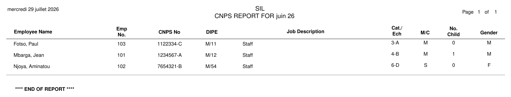
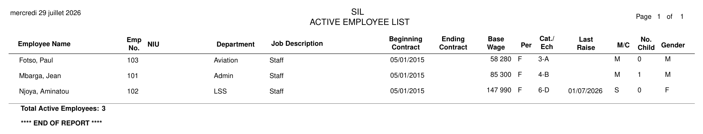
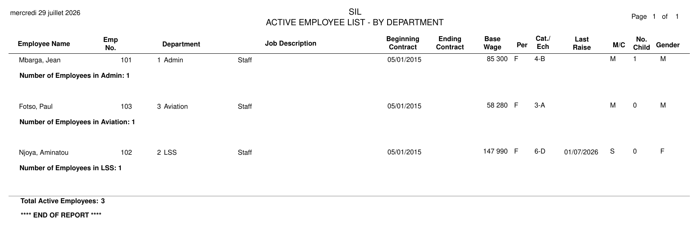

# Employee Grade Reports: CNPS, Employee, and Employee by Department

This note covers three related PDF reports and a fix to how they resolve an
employee's category/echelon (grade) and base wage:

| Report | Class | Used for |
|---|---|---|
| CNPS Report | `CnpsReport` | CNPS (social security) filing, grouped by employee |
| Employee Report | `EmployeeReport` | Active employee list for a period |
| Employee Report - By Department | `EmployeeByDepartmentReport` | Same, grouped by department |

All three are requested for a specific period (year/month) and list the
employees who have a processed payslip for that period.

## Which period's grade do these reports show?

Each report joins to `payslips` filtered to the requested period. As of this
fix, the employee's category/echelon (and, for the Employee and Employee by
Department reports, the base wage looked up from those) are read **from that
payslip row** (`ps.category`, `ps.echelon`) — the grade the employee actually
had when that period was processed, permanently pinned at processing time via
`Payslip#store_employee_attributes`.

Practically: running the June report in August always shows June's grade,
even if the employee has since received a raise. Reprinting last year's
report always reproduces what was true back then.

## Previous behavior (before this fix)

Previously, all three reports joined to the period's payslip only to decide
*which employees* to list, then read `e.category`/`e.echelon` from the
**live** `employees` table for the actual grade shown — and, for the Employee
and Employee by Department reports, used that same live grade to look up
base wage. A raise granted *after* a period was processed would retroactively
change how that already-closed period's report displayed the employee's
grade and base wage, even though nothing about that period actually changed.
Two of the three reports carried a `# FIXME: this report is always current,
or a reflection of the status in this period?` comment documenting the
ambiguity.

This mirrors the pattern `SalaryChangesReport` already used correctly (it
reads `category`/`echelon` off two payslip rows to compare "before" and
"after"), and is Phase 0 of a larger effective-dated-raise initiative tracked
in `PLAN_raise_effective_date.md` on the `plan/raise-effective-date` branch
(not yet merged). This report fix ships independently of that larger plan.

## Known, separate limitation: "Last Raise"

The Employee and Employee by Department reports also show a **Last Raise**
column. This is simply the most recent `Raise` record on file for the
employee, with **no period scoping at all** — unlike category/echelon, this
column was not part of this fix and still reflects whatever raises exist at
the time the report is run, including raises dated after the report's own
period. See the sample images below, and the effective-dated-raise plan
mentioned above for the broader plan to make raises period-aware end to end.

## Sample output

Sample data: three employees processed for June 2026. Aminatou Njoya is
granted a raise (category six/echelon d &rarr; category eight/echelon f)
dated July 1, 2026 — **after** June's payslip was already processed.

**CNPS Report** — Njoya's June row still shows her June grade, `6-D`:

**Employee Report** — Njoya's `Cat./Ech` (`6-D`) and `Base Wage` (`147 990`)
both stay pinned to June, but `Last Raise` shows the July raise anyway (the
known limitation above):

**Employee Report - By Department** — same data, grouped by department:

